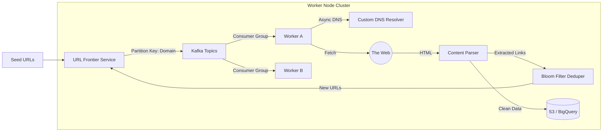

# Architecting a 10B Page/Day Distributed Crawler

## The Challenge: The Politeness vs. Throughput Paradox
In an enterprise crawling environment, the goal isn't just speed; it's **sustainable throughput**. 
Hitting 10 million domains a day requires a system that is aggressive enough to meet SLAs but "polite" enough to avoid getting IP-banned.
The central engineering challenge is **Distributed Rate Limiting**. How do you ensure that 500 crawler nodes collectively do not hit `wikipedia.org` more than 10 times per second?

## High Level Design (HLD)

We moved away from a simple queue-based system to a partitioned architecture managed by a custom "Frontier" service.



## The URL Frontier: Implementing Drumm-Buffers
A standard FIFO queue fails because it mixes "fast" domains (your own CDN) with "slow" domains (rate-limited sites).
We implemented a **Drumm-Buffer** (Dynamic Ranked URL Memory Manager) inspired by the Mercator crawler.

1.  **Front Queues (Priority)**: $F_1 \dots F_n$. URLs are placed here based on PageRank or Business Priority.
2.  **Back Queues (Politeness)**: $B_1 \dots B_m$. Each queue maps to exactly **one domain**.
3.  **Heap Mapper**: A min-heap tracks the "Next Allowable Request Time" for each Back Queue.

```python
import heapq
import time

class PolitenessHeap:
    def __init__(self):
        # (next_request_time, queue_id)
        self.heap = []
        
    def push_domain(self, queue_id, last_access_time, crawl_delay):
        next_time = last_access_time + crawl_delay
        heapq.heappush(self.heap, (next_time, queue_id))
        
    def pop_ready_queue(self):
        if not self.heap:
            return None
            
        next_time, queue_id = self.heap[0]
        if next_time > time.time():
            # Nothing is ready, system should sleep or process maintenance
            return None
            
        return heapq.heappop(self.heap)[1]
```

## Scale Challenge: DNS Resolution
At 50,000 requests per second, the OS-level `getaddrinfo` becomes a blocking bottleneck. Linux default DNS caching is insufficient for this volume.
We built a custom **Async DNS Resolver** in Rust using `trust-dns`.
*   **Caching Strategy**: We respect TTL but pre-fetch hot domains before expiry.
*   **Concurrency**: 100% non-blocking. A single thread handles 10k DNS lookups.

## Deduplication: The Storage Cost
Storing 100 Billion URLs in a database index for "Accepted/Rejected" checks is expensive.
We utilized a **Bloom Filter** with a specialized rotation strategy.

*   **Size**: 20GB memory-mapped file.
*   **Error Rate**: Tuning for $p=0.001$ false positive rate is acceptable (skipping 1 in 1000 valid pages is better than crashing storage).
*   **content-deduplication**: We use **SimHash** (locality-sensitive hashing) to detect near-duplicate content (e.g., essentially the same page but with different session IDs).

## Conclusion
Building a crawler is an exercise in edge-case management. The happy path is 10% of the code. The other 90% is handling malformed HTML, infinite redirect loops, spider traps, and aggressive rate limiters.
