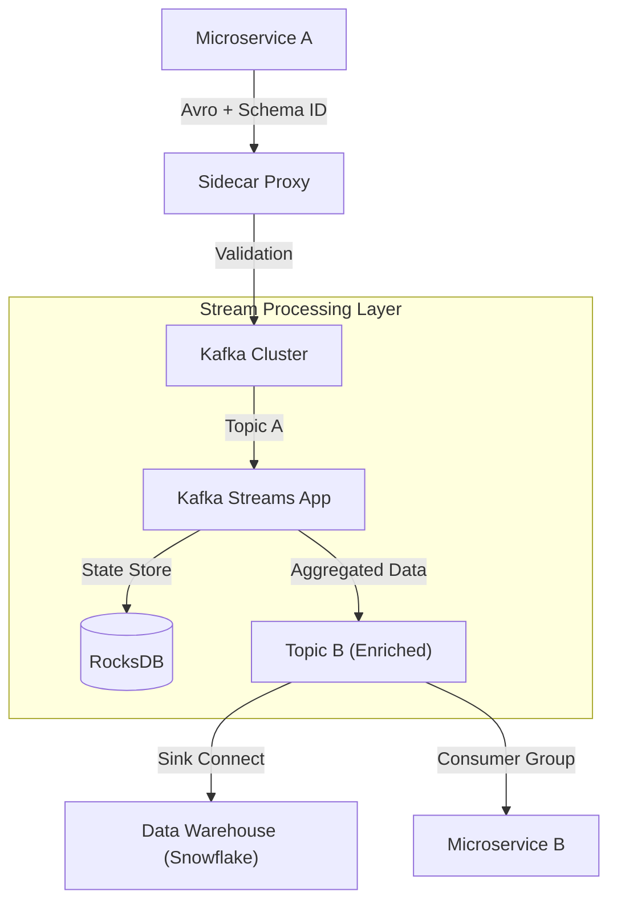

# Enterprise Event Mesh: Kafka at Petabyte Scale

## The Challenge: Beyond "Pub/Sub"
In a mature enterprise architecture, Kafka is not just a pipe; it is the **System of Record** for state changes. 
Handling petabytes of retention and millions of messages per second introduces "Day 2" operations problems that basic tutorials ignore:
1.  **Duplicate Processing**: At scale, "At-Least-Once" delivery guarantees duplicates.
2.  **Rebalancing Storms**: A single slow consumer can halt processing for the entire cluster.
3.  **Data Governance**: Schema evolution without breaking downstream teams.

## High Level Design (HLD)

Our architecture treats the Kafka Cluster as the central nervous system, with strict contracts (Schema Registry) and active stream processing (Kafka Streams/KSQL).



## Challenge 1: The "Exactly-Once" Grail
Financial transactions require Exactly-Once Semantics (EOS). We cannot double-charge a customer.
We utilized **Kafka Transactions** (KIP-98) which allows atomic writes across multiple partitions.

```java
// Atomic "Read-Process-Write"
producer.initTransactions();

try {
    producer.beginTransaction();
    
    // 1. Process data
    ConsumerRecords records = consumer.poll(Duration.ofMillis(100));
    process(records);
    
    // 2. Write result to output topic
    producer.send(new ProducerRecord<>("output-topic", result));
    
    // 3. Commit offsets AND data atomically
    producer.sendOffsetsToTransaction(offsets, consumer.groupMetadata());
    producer.commitTransaction();
} catch (Exception e) {
    producer.abortTransaction();
}
```
This ensures that the output message and the offset commit happen **together**. If one fails, both rollback.

## Challenge 2: Rebalancing Storms
With 500+ consumers in a group, a "Stop-the-World" rebalance can take minutes.
We implemented **Static Membership** (KIP-345). By assigning a persistent `group.instance.id` to each Kubernetes pod, transient restarts (e.g., rolling deploys) do **not** trigger a rebalance. The group leader "holds" the partition assignment for `session.timeout.ms` (e.g., 5 mins).

```properties
# consumer.properties configuration
group.instance.id=pod-payment-service-x9s2
session.timeout.ms=300000 
heartbeat.interval.ms=3000
```
**Result**: 0% downtime during rolling deployments.

## Challenge 3: Schema Evolution
JSON payloads are a liability. A typo in a field name breaks consumers 3 hops downstream.
We enforced **Avro with Confluent Schema Registry**.
*   **Compatibility Mode**: `FORWARD_TRANSITIVE`.
*   Producers *cannot* publish unless the schema is registered and compatible.
*   Consumers automatically download schemas to deserialize messages.

## Conclusion
Kafka at scale is about **Governance**. You need strict types (Avro), atomic guarantees (Transactions), and stability patterns (Static Membership). Treating Kafka as a "dumb pipe" is a recipe for data corruption.
