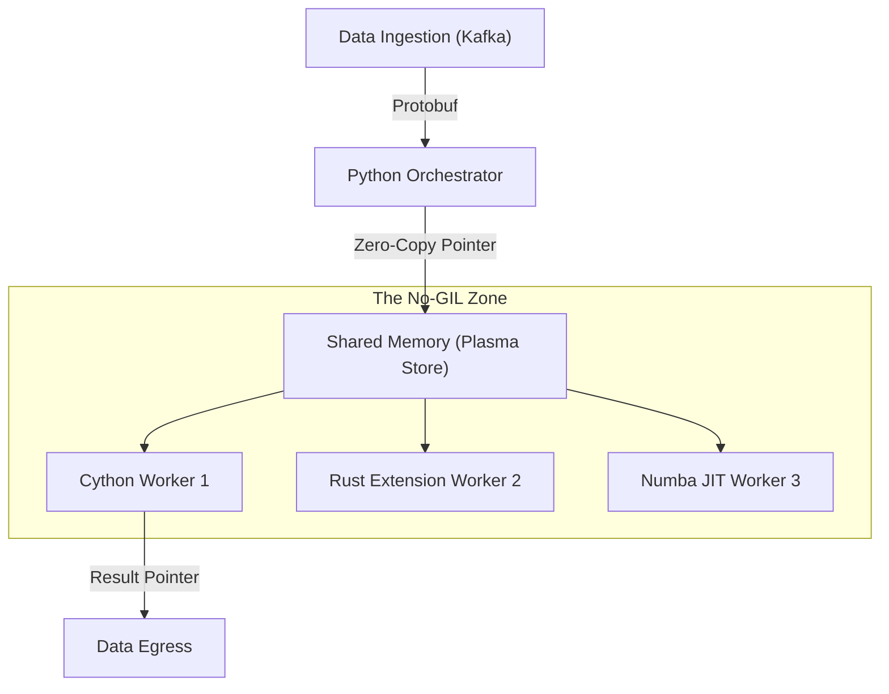

# Extreme Python: Optimizing for High-Frequency Trading Speeds

## The Challenge: Microsecond Latency in Python
Python is the language of Data Science, but it is rarely the language of High-Frequency Trading (HFT) or Real-Time Bidding (RTB). 
However, the ecosystem (pytorch, numpy, pandas) is too valuable to discard. 
The challenge is: **How do we keep the developer velocity of Python while hitting C++ latency targets?**

We encountered this when building a real-time geospatial inference engine that needed to process **100,000 events per second**.

## High Level Design (HLD)

The architecture relies on a **"Split-Brain"** model. The control plane runs in pure Python, while the data plane stays entirely in unmanaged memory (C/C++), enabling us to bypass the GIL (Global Interpreter Lock).



## Solution 1: Bypassing the GIL with Cython
We identified a hot loop calculating Haversine distances that was consuming 60% of CPU.
Rewriting it in **Cython** with direct C-level memory access and OpenMP parallelism yielded a **100x speedup**.

```python
# fast_geo.pyx
# cython: boundscheck=False, wraparound=False, cdivision=True, nonecheck=False

cimport cython
from libc.math cimport sqrt, sin, cos, radians

def parallel_distance_calc(double[:] lats, double[:] lons):
    cdef int n = lats.shape[0]
    cdef double[:] results = ... # Pre-allocated memory
    cdef int i
    
    # Release the GIL to allow multi-core execution
    with nogil:
        for i in range(n):
            results[i] = _haversine_c(lats[i], lons[i])
            
    return results
```
**Impact**: The `with nogil` context manager allows other Python threads to run freely, effectively giving us true multi-threading in Python.

## Solution 2: Zero-Copy IPC
Passing largy NumPy arrays between processes using `multiprocessing.Queue` triggers **Pickling**, which copies data. 
At 1GB/sec throughput, copying is the bottleneck.
We implemented **Zero-Copy IPC** using `multiprocessing.shared_memory`.

```python
# Writer Process
from multiprocessing.shared_memory import SharedMemory
import numpy as np

# Create 1GB shared buffer
shm = SharedMemory(create=True, size=1024*1024*1024, name='hft_buffer')
shared_arr = np.ndarray((1024, 1024), dtype=np.float64, buffer=shm.buf)
shared_arr[:] = heavy_computation() # Direct write to shared RAM

# Reader Process
existing_shm = SharedMemory(name='hft_buffer')
read_arr = np.ndarray((1024, 1024), dtype=np.float64, buffer=existing_shm.buf)
# read_arr is instantly available, NO COPYING occurred!
```

## Solution 3: JIT Compilation with Numba
For ad-hoc mathematical functions where writing C is overkill, we use **Numba**.
It inspects Python bytecode matches it to LLVM IR, generating optimized machine code at runtime.

```python
from numba import njit, prange

@njit(parallel=True, fastmath=True)
def monte_carlo_pi(nsamples):
    acc = 0
    for i in prange(nsamples):
        x = np.random.random()
        y = np.random.random()
        if (x**2 + y**2) < 1.0:
            acc += 1
    return 4.0 * acc / nsamples
```
**Result**: This runs within 5% of the speed of handwritten Fortran.

## Conclusion
Python is not slow; the interpreter is slow. By treating Python as a "glue" language that orchestrates high-performance kernels (Cython/Rust/Numba), we can build systems that rival C++ engines in performance while maintaining Python's superior developer experience.
