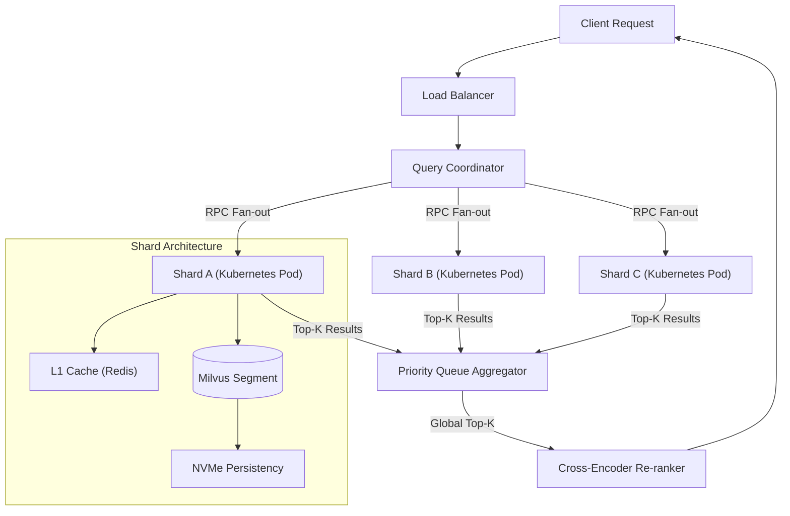

# Scaling Milvus: Architecting for Billion-Scale Vector Retrieval

## The Challenge: Hitting the Hardware Wall
In large-scale enterprise environments, "billion-scale" isn't a buzzword—it's an infrastructure liability. 
A standard 768-dimensional float32 vector requires approx **3KB** of storage. 
For **1 Billion vectors**, the raw data alone consumes **3TB**. 
Most high-memory instances (e.g., AWS r6g.16xlarge) cap at 512GB RAM. 
Trying to load a 3TB index into memory is physically impossible on a single node.

This forces a distributed architecture where the bottleneck shifts from **compute** to **memory bandwidth** and **network I/O**.

## High Level Design (HLD)

We moved from a monolithic vector engine to a sharded, distributed retrieval system using a **Scatter-Gather** pattern.




### Architecture Breakdown

This isn't just a diagram; it's the physical path of a query. Let's trace a 15ms lifecycle:

1.  **Load Balancer & Coordinator**: The query enters via the LB to a stateless Coordinator. The Coordinator does NOT search. It functions as a **MapReduce master**, fan-out broadcasting the query to all active Shard Leaders.
2.  **RPC Fan-out**: We used gRPC for inter-node communication. Each shard is an independent pod that owns 1/Nth of the dataset (approx 20 million vectors per shard).
3.  **Shuffle & Sharding**: Data is sharded by `consistent_hashing(entity_id)`. This ensures that even if we lose a node, rebalancing only moves $1/N$ of the data.
4.  **Local Execution (The "Leaf")**: Inside each Kubernetes Pod (Query Node), the search executes across **hundreds of local segments** (sealed data files). A single pod manages ~20M vectors divided into 512MB segments.
5.  **Global Aggregation**: Each shard returns its local `Top-K`. The Aggregator prioritizes these partial results into a global `Top-K`.
6.  **Re-Ranking**: The raw IVF_PQ results are approximate. The Re-Ranker pulls the full-precision vectors for just the finalists and re-scores them to achieve 99% accuracy.

## Deep Dive: Indexing Strategy - The Memory Limit

To understand why standard indexing fails at this scale, we must look at the data structures.

### The HNSW Trap (Hierarchical Navigable Small World)
HNSW is the industry standard for in-memory vector search because it offers $O(\log N)$ time complexity. It builds a multi-layer graph where:
*   **Layer 0**: Contains all nodes (vectors).
*   **Layer N**: Contains a subset of nodes acting as "expressways" to skip across the graph.

**The Problem**: Every node needs to maintain connectivity logic (Friends List).
For a graph with `M=16` (max edges per node), you store 16 integer pointers per vector.
$$ \text{Overhead} \approx 16 \times 4 \text{ bytes} \times 2 (\text{bidirectional}) = 128 \text{ bytes} $$
This sounds small, but for **1 Billion vectors**, the graph connectivity *alone* consumes **128GB of RAM**—before you even load the 3TB of actual vector data.

### The Enterprise Solution: IVF_PQ + SSD Offloading

We moved from a "Pure In-Memory" mindset to a "Memory-Mapped" strategy.

#### 1. Inverted File Index (IVF) - The Coarse Quantizer
Instead of a massive flat graph, we perform **Voronoi Tessellation** on the vector space.
*   We train `nlist=65536` centroids (cluster centers) using K-Means.
*   Every billion vectors are assigned to their nearest centroid.
*   **Search Time**: Instead of scanning 1B vectors, we confirm which centroid the query vector falls into, and then only scan the vectors in that cell (and perhaps its neighbors, defined by `nprobe`).
*   **Optimization**: This reduces the search space by factor of $\frac{1}{\text{nlist}} \approx \frac{1}{65000}$.

#### 2. Product Quantization (PQ) - The Compression
Even with IVF, storing 3TB of float32 vectors on disk is slow to read. We need to shrink the vectors.
PQ splits the 768-dimensional vector into $m=64$ sub-spaces.
*   Each sub-vector (12 dimensions) is quantized into one of 256 centroids (1 byte).
*   We replace the raw float32 values with the *ID* of the nearest centroid.
*   **Math**: $768 \times 32 \text{ bits} \to 64 \times 8 \text{ bits}$.
*   **Result**: A 96% reduction in storage I/O, allowing us to perform the coarse search entirely in memory while keeping the raw data on NVMe SSDs for the final re-ranking.

## Addressing the Recall Gap
The aggressive compression of PQ reduces recall (accuracy).
$$ \text{HNSW Recall@10} \approx 0.98 $$
$$ \text{IVF\_PQ Recall@10} \approx 0.85 $$

To bridge this 13% gap without exploding memory, we implemented a **Two-Stage Retrieval** pipeline.

### Stage 2: Cross-Encoder Re-Ranking
We fetch `Top-100` candidates using the fast but lossy IVF_PQ index, then fetch the full raw text/vectors for just those 100 items and pass them through a BERT-based Cross-Encoder.


```python
from sentence_transformers import CrossEncoder
import numpy as np

# Load a high-precision but slow model
model = CrossEncoder('cross-encoder/ms-marco-MiniLM-L-6-v2', device='cuda')

def re_rank_candidates(query: str, candidates: list[dict]):
    """
    candidates: List of { 'id': int, 'text': str, 'score': float }
    """
    # Create (Query, Document) pairs
    pairs = [(query, doc['text']) for doc in candidates]
    
    # Inference on GPU (Batch size 100 takes ~15ms)
    scores = model.predict(pairs)
    
    # Re-sort based on semantic similarity
    ranked_indices = np.argsort(scores)[::-1]
    return [candidates[i] for i in ranked_indices[:10]]
```

## Optimizing Network Throughput
A hidden killer in distributed search is the serialization overhead of returning large feature vectors.
We utilized **Protocol Buffers (gRPC)** instead of JSON over REST, reducing payload size by 40% and deserialization CPU time by 70%.

## Conclusion
Scaling is not about throwing more hardware at the problem; it's about understanding the specific bottlenecks of your data structure. By accepting a controllable loss in precision (PQ) and correcting it with compute (Re-ranking), we achieved **billion-scale retrieval on commodity hardware**.
